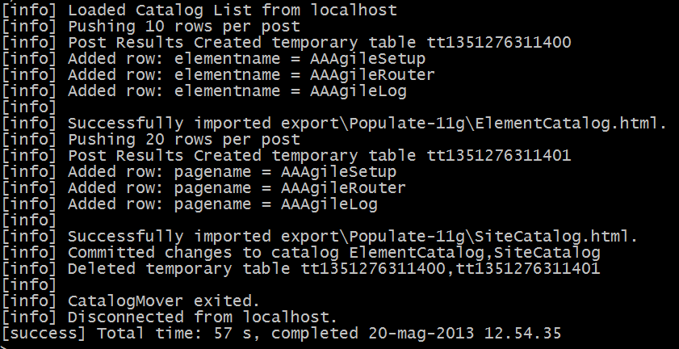

## Download 

AgileSites is distributed as a source zip from GitHub.

You need to download a stable release of AgileSites from GitHub. Stable releases are [listed here](http://www.agilesites.org/download.html)

It is recommended you pick the latest stable version, 
unzip it in a folder of your choice where you put your projects. Then read on to learn how to configure and install it.

## Configuration

Configuration is now fully automated.

Once downloaded and extracted you just need to execute the `agilesites.cmd` or `agilesites.sh` script.

A GUI will popup asking for the main installation directory. It will detect automatically the configuration.

Sometimes, since CSDT is not always included in the installation, it may be needed to specify manually where the csdt jar is located if it is not found automatically.

The configuration will then ask for the password of the user `fwadmin` (that is `xceladmin` unless you changed it), and the name of the site you are going to use for development (in the tutorial samples it is called `MySite`).

### What the configurator does 

The configurator reads the file `build.sbt.dist` and creates a `build.sbt`

You can tweak the generated configuration or write one from scratch copying the `build.sbt.dist` in `build.sbt` if it does not fit with your needs.

An important tweak is to add a new WebCenter Sites site in the `build.sbt`, editing the `wcsSites` setting value.

**NOTE** If you change the value of `wcsSites` then it is needed to repeat the `wcs-setup` procedure.

**NOTE** Some additional manual configurations is needed for Satellite and Apache since they cannot be detected manually. You can read about Satellite and Apache front end installation in the [deployment reference](http://www.agilesites.org/reference/Deployment.html).

**HINT** You can read details of the configuration in the [configuration reference](http://www.agilesites.org/reference/Configuration.html) to understand each parameter if in doubt.


## Installation 

Ensure you have a connection to internet and start the AgileSites shell running either `agilesites.bat` or `agilesites.sh`

**NOTE** The first time the shell is started, it will take some time before you get an answer, since it will download a number of dependencies from internet and will build the core library. 

**HINT** If you are performing an installation using an existing code base and you have weird behaviours, you can force the repositories to a safe state before running the `clean.bat` or `clean.sh` script  before starting the shell. Note that  the clean the build will take some time like the first time because everything will have to be downloaded again.

**HINT** If you get errors or exceptions, please review the paths carefully. A wrong path is by far the most common cause of failing installation. The problem should not happen if you are using the automated configurator.

The installation has then 3 simple steps, one optional.

- mandatory offline setup (command `wcs-setup`)
- optionally import (command `wcs-dt import` that invokes CSDT)
- mandatory online deploy (command `wcs-deploy`)

## Setup (offline)

Once you get the prompt `>`, stop the application server with Sites and execute:

`wcs-setup`

The setup command checks that Sites is not running and will stop if it finds a running Sites.

After the setup  you must start the application server. 

Since it can takes some time before it is active, it is useful to wait until you get an answer, invoking the command `wcs-hello`; it  will return when Sites is up and running, and print the version of Java that it is using.

This command also checks if AgileSites is using the same Java version as Sites (because using different versions can cause problems).

##  Importing the Demo site (Optional) 

If you are going to do some development, you may want to import the Demo site in the CMS. You can skip step but if do it, there will be nothing visible of the framework inside the CMS, so you will have to create your site as described in the [tutorial](http://www.agilesites.org/tutorial.html). 

The import of a site is performed using the CSDT development tool integrated in the AgileSites shell.

If you are using WebCenter Sites 11.1.1.8.x to import the demo site all you need to run is the command:

```
wcs-dt import #Demo-11.8
```

If instead you are using WebCenter Sites 11.1.1.6.x to import the demo site all you need to run is the command:

```
wcs-dt import #Demo-11.6
```



## Deployment (online)

Once you have installed the core library and eventually imported the demo site, you can complete the installation running

```
wcs-deploy
```

If you have imported the demo site, you can check if it is now up and running with:

> http://localhost:8080/cs/Satellite/demo

Change it according your actual installed host, port and path.


Run tests accessing to  

> http://localhost:8080/cs/ContentServer?pagename=Demo_Tester

then click on "Run All Tests" and expect 0 tests failed.

This will complete the installation of the framework.

You can now create a new site following the [tutorial](http://www.agilesites.org/tutorial.html) or go on this document to learn how to import the demo site.

## Apache and Satellite

The installation for development is complete but for live deployment you need to configure also Satellite Server and Apache.

You can learn how to configure a Satellite and Apache front end installation in the [deployment reference](http://www.agilesites.org/reference/Deployment.html).