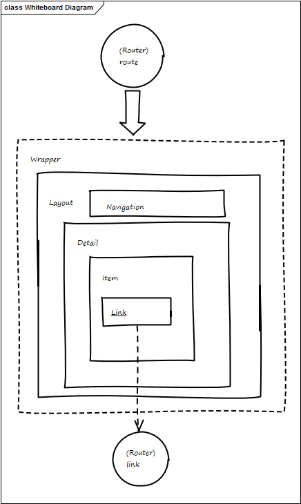

**NOTE** For version 1.0, not yet updated to 1.8

The following image describes the standard rendering process: 



Requests are captured by the user assembler that invokes the `Router.route` method to decide how to render the url request.

The router task is decoding the url, selecting the c/cid and then invoking the Wrapper with the appropiate parameters. Normally you have only one wrapper but it is not uncommon to have more than once (for example one wrapper for desktop and another for mobile).

The Wrapper will usually  render the non-visibile part of the html page, and will select the layout to use (usually reading the template field of the current asset).


The Layout (that is usually different for each asset type and subtype) renders the general skeleton on the page, including various navigations.

As a convention, the main body of the page is usually rendered by a Detail template who in turn can have related Item and SubItem. Finally when a linked asset is reached, then the Link will be generated using the `Asset.getUrl` method. Note that this method will in turn call the `Router.link` method to an asset c/cid can be translated in a string that can be handler properly by the `Router.route` method.

## Router

Here we give a  look to the router. It has 2 functions: decoding  (`route` method) urls in assets and encoding then in url (`link` method).

### Router.route

The router purpose is decoding the url and translate an url in an asset to be rendered.

The default route assumes requests coming from the web have one of the following formats:

- http://www.mysite.com/cs/Satellite/mysite
- http://www.mysite.com/cs/Satellite/mysite/PageName
- http://www.mysite.com/cs/Satellite/site/AssetType/AssetType

The router will receive only the part of the url after the prefix `http://www.site.com/cs/Satellite/site` and will translate it in an invokation of the `Wrapper` with `c` and `cid` of the entry poing asset.

So the default code will take strings like "",  "/Hello" or "/News/Welcome" and look for an asset by name. The empty string will return c/cid of the Page asset named Home, the "/Hello" will return the "Page" named "Hello" and the "/News/Welcome" will return an (eventual) asset "Demo_News" with name "Welcome".

Of course the router code can be changed to better fit your purposes.

**NOTE** The `/cs/Satellite/site` part is normally removed by the Apache web server with a proxy rule like

```
<VirtualHost www.site.com>
ProxyPass / http://appserver:8080/cs/Satellite/mysite
</VirtualHost>
```

### Router.link

The router link method is invoked when generating a link to render a specific asset. It receives the c/cid of the asset that should be rendered and translates it in the url part that follows the prefix (`http://www.mysite.com/cs/Satellite/mysite`). The default implementation is pretty simple: it takes the name of the asset and returns it if it is a Page, otherwise it will add the asset name (wthout a prefix). As a special case, a Page named Home is returned as the empty string.


