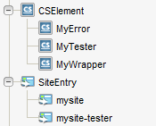

(Draft)

This document is a reference guide of the code generated with scaffolding.

## Scaffold `site`

The generated code is in the `agilesites-app` project, in the source folder `src/main/java` in the package with the name you chose (in this case `mysite`).

The generated project has 3 packages:

- `mysite`
- `mysite.element`
- `mysite.test`

Let's discuss the default content of the three packages

### `mysite` classes

In the package `mysite` there are 3 (mandatory) files:

- `Config`
- `Setup`
- `Router`

The `Config` is the holder of configuration files. It provides the site name and some important methods detailes in the API. You are not expected to change it, unless you need to customise the Configuration.

The `Setup` code will be executed to setup your site templates when you you execute the `wcs-deploy` command. You are not expected to change it unless you need to add custom initialization. 

The `Setup `reads the resource file `src/main/resources/elements.txt` and install all the elements listed there.

The `Router` is responsible for translating URL in assets or other invocations (for example Ajax calls), and for generating the mapping of an asset into an URL. Please check the [architecture](/reference/Architecture.md) to fully understand the role of the router. 

The default `Router.route` maps Page names in URL and viceversa. The default code read the url portion managed by the router and looks for a page whose name matches the name.

The default `Router.link` does the opposite: provided an asset Page, it will return its name as url fragment for locating it.

The router can be extended to manage arbitrary and complex URL mappings.

### `mysite.element` classes

The standard wizard will generate 3 classes:

- `Wrapper`
- `Tester`
- `Error`

Those 3 classes are all CSElements. In the code of the class there is the configuration of the CSElement and the actual CSElement was created whey you performed the `wcs-deploy` step. 

If you inspect with the Admin in the Dev tab what has been created you will see the following SiteEntry 

Please check the [Architecture](/reference/Architecture.html) document to understand how they fit in the big picture.

The `Wrapper` is invoked by the `Router` after the routing is performend. The `Wrapper` is supposed to be unchached so it must contains no or very limited data access (definitely *not* flex asset field extraction).

`Error` is invoked through the wrapper  when no asset has been.

And finally the `Tester` is invoked with `/cs/Satellite?pagename=site-tester` (change *site* with the lower-case version of your site name) to run tests.

### `mysite.tests` classes 

Default test classes.

## Scaffold `layout`

Generate a new layout template, with a test.

## Scaffold `template`

Generate a new internal template, with a test

## Scaffold `cselement`

Generate a new cselement, with a test

 