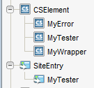

##### Prev:  [Configuration](Configuration.md)

In this section we describe which steps are needed in order to create a new site, both in Site and in AgileSites, and start development.

## Create a site in Sites

After the configuration and the installation of the configuration, you can now create a new site.

Access to the Sites admin (see the image below).

Create a new site with the chosen name (in this case *MySite*), enabling at least the following assets:

- Template
- CSElement
- SiteEntry
- AttrTypes
- Page
- PageAttribute
- PageDefinitions

After creating the site, you need also to create an user and assign to that user at the minimum the following roles for your site *MySite*

- AdvancedUser
- SitesUser
- GeneralAdmin

Once done you need to log out and then log in again to select your new site as the active site.

## Generate the AgileSites site code

Once created the site in Sites, you can use generate the site code from the shell with the command:

``wcs-generate site``

A popup will appear asking for the site name (use `MySite` or your own) and the site prefix (user `My` or your own).

Then you need to deploy templates and cselements for the site.

``wcs-deploy``

## Access the new site and the tester

Accessing the site with 

> http://localhost:8080/cs/Satellite/mysite

You should see the following screenshot:

It is normal since you do not have yet any page, so the Error Page is displayed, declaring it cannot find the home page (that does not yet exist).

You can then invoke the tester with:

>http://localhost:8080/cs/ContentServer?pagename=MyTester

You should see this screenshot:

Clicking on "Run All Tests" you should expect no errors:

You can also select a few tests and run only the selected tests clicking on "Run Some Tests". Try it.

## Importing the project in eclipse

**Note**: you need the eclipse plugin [http://www.scala-ide.org](http://www.scala-ide.org "Scala IDE") to use the default export. Projects are currently Java only, but planned extensions of the framework  will allow also Scala coding. 

Once the new site and the new project has been created you can generate configuration files for your IDE. Execute the command in the shell:

`eclipse`

Using eclipse you can then select the following sequence of options to import the projects in Eclipse:

> File | Import | General | Existing Projects 

opening the main directory of AgileSites. You should see the following screenshot:

then selecting the folder where you unzipped AgileSites, you should see 3 projects.

Select all of them. You will work mostly only on the `agilesites-app` project for implementing your application code.  However other projects are required for compilation.

You may change the `agilesites-api` core if you want to extend the framework adding your functionalities. If you do so, consider contribute them to the project. 

You are not expected to change the `agilesites-core` code except for adding very low level functionality. 

**NOTE** You may import the project without the Scala Plugin in Eclipse (for example manually removing the ScalaNature option from the project) or even working with different IDEs than eclipse. That is fine but it is not covered in the tutorial you are reading. So your mileage may vary.

## Walk-through of the generated source code 

The generated code is in the `agilesites-app` project, in the source folder `src/main/java` in the package with the name you chose (in this case `mysite`).

The generated project has 3 packages:

- `mysite`
- `mysite.element`
- `mysite.test`

Let's discuss the default content of the three packages

### `mysite` classes

In the package `mysite` there are 3 (mandatory) files:

- `Config`
- `Setup`
- `Router`

The `Config` is the holder of configuration files. It provides the sinte name and some important methods detailes in the API. You are not expected to change it, unless you need to customise the Configuration.

The `Setup` code will be executed to setup your site templates when you you execute the `wcs-deploy` command. You are not expected to change it unless you need to add custom initialization. 

The `Setup `reads the resource file `src/main/resources/elements.txt` and install all the elements listed there.

The `Router` is responsible for translating URL in assets or other invocations (for example Ajax calls), and for generating the mapping of an asset into an URL. Please check the [architecture](/reference/Architecture.md) to fully understand the role of the router. 

The default `Router.route` maps Page names in URL and viceversa. The default code read the url portion managed by the router and looks for a page whose name matches the name.

The default `Router.link` does the opposite: provided an asset Page, it will return its name as url fragment for locating it.

The router can be extended to manage arbitrary and complex URL mappings.

### `mysite.element` classes

The standard wizard will generate 3 classes:

- `Wrapper`
- `Tester`
- `Error`

Those 3 classes are all CSElements. In the code of the class there is the configuration of the CSElement and the actual CSElement was created whey you performed the `wcs-deploy` step. 

If you inspect with the Admin in the Dev tab what has been created you will see the following SiteEntry 

### `mysite.tests` classes 

#####  Next:  [New Template](NewTemplate.md)