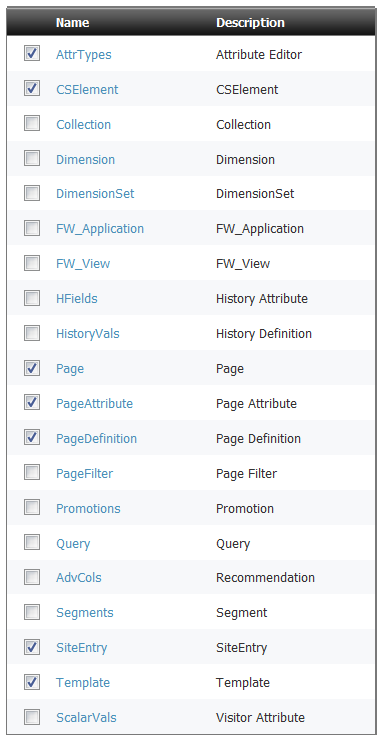
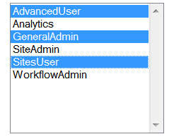

##### Prev: [Prerequisites](Prerequisites.md) Next:  [New Template](NewTemplate.md)

In this section we describe which steps are needed in order to create a new site, both in Site and in AgileSites, and start development.

## Choose a name and a prefix

The first step is naming your new site. Here I am assume your choice is **MySite**. Of course you need to change samples accordingly to your decision if you choose a different name.

Also you need to choose a prefix that you will use consistently to name specific assets of your sites (most notably types, content definitions, attributes). 

The prefix is a common conventions used to avoid name clashes. Here I will use the prefix *My*.

**NOTE** We experienced problems when Content Definitions or Attributes have the same name in 2 different sites. So we recommend to use always a prefix when naming Types, Attributes, Content and Parent definitions, in order to guarantee the uniqueness of the names. Templates are also automatically named with a prefix when created by the deployer (see later in this tutorial).

## Configure a new site and a virtual host

Edit the `build.sbt` and put your site name in the `wcsSites` variable. For example:

``
wcsSites in ThisBuild := "MySite"
``

If you have a virtual host configured (with satellite and apache in place) for your new site then you should also configure virtual hosts mapping.

For example if you have a front-end url `http://www.mysite.com` for the site `MySite` you should add a line mapping the site to the 

``
wcsVirtualHosts in ThisBuild += ("MySite" -> "http://www.mysite.com")
``

You can remove others sites but if they were already installed the installer won't remove configurations for them so they will be still be available in your instance of the application server.

## Reinstall to update configurations

**THIS STEP IS IMPORTANT**

 After changing the name  of the current site, you **need** to reinstall. Installation is needed in order to create  the appropriate configurations. 

**EXIT THE SHELL** (in order to reload the configuration file) then follow the reinstallation steps (check the [Installation Guide](http://www.agilesites.org/install.html) for more details).

This is a reminder if you have already read it.

On Content Server (Sites):

- shut down the application server running Sites,
- execute again the ``wcs-setup-offline`` command
- restart it  
- execute again the ``wcs-setup-online`` command.

On Satellite Server:

- shut down the application server running Sites
- execute again the ``wcs-setup-offline satellite`` command
- restart it  

## Create a site in Sites

After the configuration and the installation of the configuration, you can now create a new site.

Access to the Sites admin (see the image below).

Create a new site with the chosen name (in this case *MySite*), enabling at least the following assets:

- Template
- CSElement
- SiteEntry
- AttrTypes 
- Page
- PageAttribute
- PageDefinitions

After creating the site, you need also to create an user and assign to that user at the minimum the following roles for your site *MySite*

- AdvancedUser
- SitesUser
- GeneralAdmin

Once done you need to log out and then log in again to select your new site as the active site.

## Generate the AgileSites site code

Once created the site in Sites, you can use generate the site code from the shell with the command:

``wcs-generate site``

A popup will appear asking for the site name (use `MySite` or your own) and the site prefix (use `My` or your own).

Then you need to deploy templates and cselements for the site.

``wcs-deploy``

You can learn more on the generated source [here](../reference/Scaffold.md).

## Access the new site and the tester

Accessing the site with 

> http://localhost:8080/cs/Satellite/mysite

You should see the following screenshot:

It is normal since you do not have yet any page, so the Error Page is displayed, declaring it cannot find the home page (that does not yet exist).

You can then invoke the tester with:

>http://localhost:8080/cs/ContentServer?pagename=mysite-tester

(in general the pagename is the lowercase version of your site name with concatenated "-tester").

You should see this screenshot:

Clicking on "Run All Tests" you should expect no errors:

You can also select a few tests and run only the selected tests clicking on "Run Some Tests". Try it.

## Importing the project in eclipse

**Note**: you need the eclipse plugin [http://www.scala-ide.org](http://www.scala-ide.org "Scala IDE") to use the generated eclipse project. Projects are currently Java only, but planned extensions of the framework will allow also Scala coding. 

Once the new site and the new project has been created you can generate configuration files for your IDE. Execute the command in the shell:

`eclipse`

Using eclipse you can then select the following sequence of options to import the projects in Eclipse:

> File | Import | General | Existing Projects 

opening the main directory of AgileSites. You should see the following screenshot:

then selecting the folder where you unzipped AgileSites, you should see 3 projects.

Select all of them. You will work mostly only on the `agilesites-app` project for implementing your application code. However other projects are required for compilation.

You may change the `agilesites-api` code if you want to extend the framework adding your functionalities. If you do so, consider contribute them to the project. 
You are not expected to change the `agilesites-core` code except for adding very low level functionality. 

